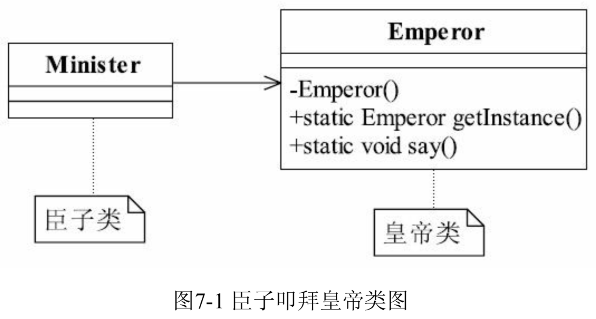
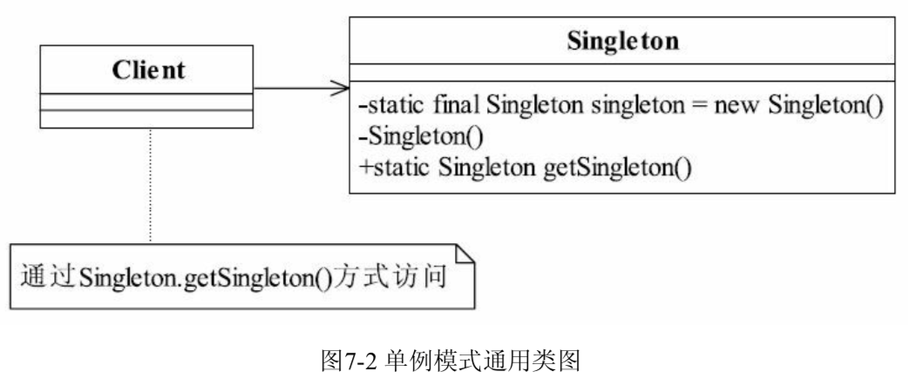
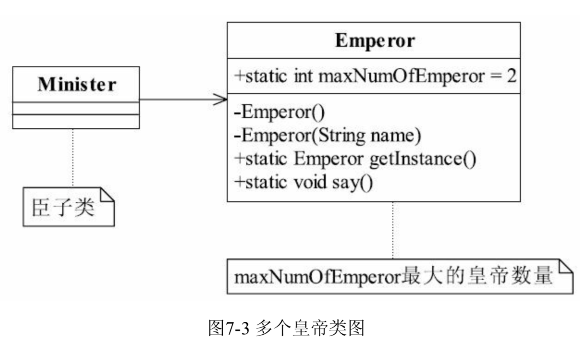

## 单例模式

### 我是皇帝我独苗

一个类只生成一个对象（皇帝），所有对象对它的依赖都是相同的，因为只有一个对象，大家对它的脾气和习性都非常了解，建立健壮稳固的关系。

一个类只产生一个对象，该怎么实现？**对象产生是通过new关键字完成**的（当然也有其他方式，比如对象复制、反射等），使用new关键字创建对象时，都会**根据输入的参数调用相应的构造函数**，可以把构造函数设置为**private**私有访问权限，就可以**禁止外部创建对象**。

臣子叩拜唯一皇帝的过程类图

<div align="center">
    
</div>
只有两个类，Emperor代表皇帝类，Minister代表臣子类，关联到皇帝类非常简单。

皇帝类

```java
public class Emperor {
    private static final Emperor emperor = new Emperor();   // 初始化一个皇帝
    private Emperor() {
        // 不希望产生第二个皇帝
    }
    public static Emperor getInstance() {
        return emperor;
    }
    // 皇帝说话
    public static void say() {
        System.out.println("我是皇帝");
    }
}
```

通过一个**私有访问权限**的构造函数，避免被其他类new出来一个对象，而**Emperor自己则可以new一个对象出来**，其他类对该类的访问都可以**通过getInstance**获得同一个对象。

臣子类

```java
public class Minister {
    public static void main(String[] args) {
        for(int day = 0; day < 3; day++) {
            Emperor emperor = Emperor.getInstance();
            emperor.say();
        }
        // 臣子见到的皇帝都是同一个人
    }
}
```

### 单例模式的定义

单例模式是一个比较简单的模式，其定义如下

Ensures a class has only one instance, and provide a global point of access to it

确保**一个类只有一个实例**，而且**自行实例化并向整个系统提供这个实例**。

<div align="center">
    
</div>

Singleton类称为**单例类**，通过**使用private的构造函数**确保了在一个应用中产生一个实例，并且是自行实例化的（在Singleton中自己使用new Singleton()）。

单例模式通用源代码7-3

```java
public class Singleton {
    private static final Singleton singleton = new Singleton();
    // 限制产生多个对象
    private Singleton() {
    }
    // 通过该方法获得实例对象
    public static Singleton getSingleton() {
        return singleton;
    }
    // 类中其他方法，尽量是static
    public static void doSomething() {
        
    }
}
```

### 单例模式的应用

#### 单例模式的优点

* 单例模式在内存中**只有一个实例，减少了内存开支**，特别是一个**对象需要频繁地创建、销毁**时，而且**创建或销毁时性能又无法优化**，单例模式就非常有优势。

* 单例模式只生成一个实例，所以**减少了系统的性能开销**，当一个对象的产生**需要比较多的资源**时，如**读取配置、产生其他依赖对象**时，则可以通过在应用**启动时直接产生一个单例对象**，然后用**永久驻留内存**的方式来解决（在Java EE中采用单例模式时需要注意JVM垃圾回收机制）。
* 单例模式**可以避免对资源的多重占用**，例如一个写文件动作，由于**只有一个实例存在内存**中，**避免对同一个资源文件的同时写操作**。
* 单例模式可以**在系统设置全局的访问点，优化和共享资源访问**，例如可以设计一个单例类，**负责所有数据表的映射处理**。

#### 单例模式的缺点

* 单例模式一般没有接口，扩展很困难，若要扩展，除了修改代码基本上没有第二种途径。

  单例模式为什么不能增加接口？

  因为接口对单例模式没有任何意义，它要求“自行实例化”，并且**提供单一实例、接口或抽象类时不可能被实例化的**。当然，在**特殊情况下，单例模式可以实现接口、被继承**等，需要在系统开发中根据环境判断。

* 单例模式**对测试不利**。在**并行开发环境**中，如果**单例模式没有完成，是不能进行测试**的，没有接口也不能使用mock的方式虚拟一个对象。

* 单例模式**与单一职责原则冲突**，一个类应该只实现一个逻辑，而不关心它是否是单例的，是不是要单例取决于环境，单例模式把“要单例”和业务逻辑融合在一个类中。

#### 单例模式的使用场景

在一个系统中，**要求一个类有且仅有一个对象，如果出现多个对象就会出现“不良反应”**，可以采用单例模式，具体场景如下

* 要求**生成唯一序列号**的环境；
* 在**整个项目中需要一个共享访问点或共享数据**，例如一个Web页面上的计数器，可以不用把每次刷新都记录到数据库中，使用单例模式保持计数器的值，并确保是线程安全的；

* 创建一个对象**需要消耗的资源过多，如要访问IO和数据库等资源**；
* 需要**定义大量的静态常量和静态方法（如工具类）的环境**，可以采用单例模式（当然，也可以直接声明为static的方式）。

#### 单例模式的注意事项

首先，在**高并发情况**下，要**注意单例模式的线程同步问题**。单例模式有几种不同的实现方式，上面的例子不会出现产生多个实例的情况。

但如下代码7-4就需要考虑**线程同步**

```java
public class Singleton {
    private static Singleton singleton = null;
    // 限制产生多个对象
    private Singleton() {
    }
    // 通过该方法获得实例对象
    public static Singleton getSingleton() {
        if (singleton == null) {
            singleton = new Singleton();
        }
        return singleton;
    }
}
```

该单例模式在低并发情况下不会有问题，若系统压力变大，**并发量增加时可能在内存中出现多个实例**，破坏了最初的预期。

为什么会出现这种情况？

如一个线程A执行到

```java
singleton = new Singleton();
```

**但还没有获得对象（对象初始化是需要时间的）**，第二个线程B也在执行，**执行到(single == null)判断，那么线程B判断条件也是为真**，于是继续运行下去，线程A获得了一个对象，线程B也获得了一个对象，在内存中就出现了两个对象。

解决线程不安全的方法很多，可以在getSingleton方法前加synchronized关键字，也可以在getSingleton方法内增加synchronized来实现，但都不是最优秀的单例模式，建议使用如代码7-3所示的方式。

其次需要考虑对象的复制情况。在Java中，**对象默认是不可以被复制的**，若实现了**Cloneable接口**，并实现了**clone**方法，则可以**直接通过对象复制方式创建一个新对象，对象复制不用调用类的构造函数**，因此**即使是私有的构造函数，对象仍然可以被复制**。在一般的情况下，类复制的情况不需要考虑，很少会出现一个单例类会主动要求被复制的情况，解决该问题的**最好方式就是单例类不要实现Cloneable接口**。

### 单例模式的扩展

如果一个类可以产生多个对象，对象的数量不受限制，扩展是非常容易实现的，直接new就好。如果只需要一个对象，使用单例模式。但如果要求一个类只能产生两三个对象，该怎么实现？

两个皇帝的情况

<div align="center">
    
</div>

固定数量的皇帝类 代码7-5

```java
public class Emperor {
    // 定义最多能产生的实例数量
    private static int maxNumOfEmperor = 2;
    // 每个皇帝都有名字，使用一个ArrayList来容纳，每个对象的私有属性
    private static ArrayList<String> nameList = new ArrayList<String>();
    // 定义一个列表，容纳所有的皇帝实例
    private static ArrayList<Emperor> emperorList = new ArrayList<Emperor>();
    // 当前皇帝序列号
    private static int countNumOfEmperor = 0;
    // 产生所有的对象
    static {
        for (int i = 0; i < maxNumOfEmperor; i++) {
            emperorList.add(new Emperor("皇" + (i+1) + "帝"));
        }
    }
    private Emperor() {
        // 目的是不产生第二个皇帝
    }
    // 传入皇帝名称，建立一个皇帝对象
    private Emperor(String name) {
        nameList.add(name);
    }
    // 随机获得一个皇帝对象
    public static Emperor getInstance() {
        Random random = new Random();
        // 随机拉一个皇帝
        countNumOfEmperor = random.nextInt(maxNumOfEmperor);
        return emperorList.get(countNumOfEmperor);
    }
    // 皇帝说话
    public static void say() {
        System.out.println(nameList.get(countNumOfEmperor));
    }
}
```

在Emperor中使用了两个ArrayList分别存储实例和实例变量。如果考虑到**线程安全问题**可以使用Vector代替。

```java
public class Minister {
    public static void main(String[] args) {
        // 定义5个大臣
        int ministerNum = 5;
        for (int i = 0; i < ministerNum; i++) {
            Emperor emperor = Emperor.getInstance();
            System.out.print("第" + (i + 1) + "个大臣参拜的是：");
            emperor.say();
        }
    }
}
```

这种产生固定数量对象的模式就叫做**有上限的多例模式**，它是单例模式的一种扩展。

采用有上限的多例模式，可以**在设计时决定在内存中有多少实例，方便系统进行扩展，修正单例可能存在的性能问题，提高系统的响应速度**。例如读取文件，我们可以在系统启动时完成初始化工作，在内存中启动固定数量的reader实例，然后在需要读取文件时就可以快速响应。

#### 最佳实践

单例模式应用广泛，Spring中每个Bean默认就是单例的，这样做的优点是Spring容器可以管理这些Bean的生命周期，决定什么时候创建出来，什么时候销毁，销毁时要如何处理等。如果用非单例模式（Prototype类型），则Bean初始化后的管理交由J2EE容器，Spring容器不再跟踪管理Bean的生命周期。

 


## 实现Singleton模式

### 用于单线程的单例模式

```java
public class Singleton1 {
	private Singleton1 () {}
    
    private static Singleton1 instance = null;
    
    public static Singleton2 getInstance() {
        if (instance == null) {
            instance = new Singleton1();
        }
        return instance;
    }
}
```

这段代码只能生成一个实例，且构造函数为私有；在静态方法中创建实例，判断`instance`是否为`null`来避免重复创建

但是这段代码只能在单线程的时候正常运行；当有多个线程访问时，如果两个线程同时运行到判断`instance`是否为`null`的if语句，这时`instance`没有被创建，但是两个线程都会去创建实例，不满足单例模式的要求

### 加锁

为了保证程序在多线程环境下正常运行，加一个同步锁

```java
public static Singleton2 {
    priavte Singleton2() {}
    
    private static Singleton2 instance = null;
    
    public static Singleton2 getInstance() {
        synchronized (instance) {
            if (instance == null) {
                instance = new Singleton2();
            }
        }
        return instance;
    }
}
```

这样在同一个时刻，只有一个线程能够拿到锁并访问实例，其他线程只能够等待；第一个线程获得`instance`实例后，判断`instance`是否为`null`，如果为`null`则创建；第一个线程释放`instance`，其他等待的线程拿到`instance`之后，发现`instance`为非空，就不会重复创建`instance`

这段代码存在的问题是，每次尝试获取实例的时候，都需要获取锁去判断`instance`是否存在；而加锁是一个相当耗费资源的操作

### 双重校验锁

实际上只需要在实例没有创建之前进行加锁，保证只有一个线程创建出实例，实例创建好之后，其它线程来获取实例，不需要进行加锁操作

```java
public static Singleton2 {
    priavte Singleton2() {}
    
    private static Singleton2 instance = null;
    
    public static Singleton2 getInstance() {
        if (instance == null) {
        	synchronized (instance) {
        	    if (instance == null) {
        	        instance = new Singleton2();
        	    }
        	}
        }
        return instance;
    }
}
```

这就是被无数面试官问烂的双重校验锁。。。面试官有可能会问你：双重校验锁为什么有两个if？两个if的作用分别是什么？加锁干什么？

可以按照以上思路回答：单线程实现单例 -> 加锁实现单例 -> 双重校验锁

1.  单例类必不可少的private修饰的构造器，根据实例是否被创建来决定是否调用构造器
2.  多线程情况下，对实例加锁
3.  为了减少加锁操作，使用双重校验锁进行优化


## 参考内容

《剑指Offer》

《设计模式之禅》