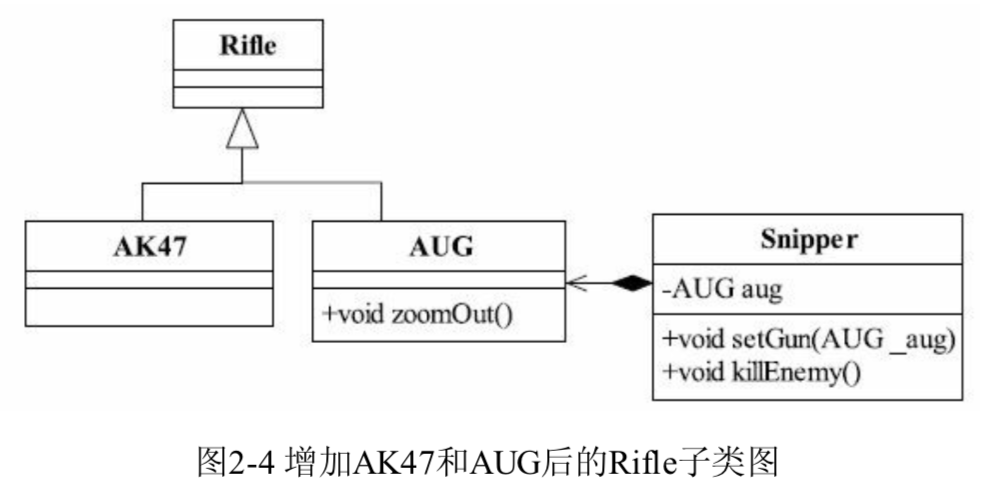

## 六大设计原则

### 单一职责原则

#### 概念

定义：应该有且仅有一个原因引起类的变更

好处：

* 类的复杂性降低，实现什么职责都有清晰明确的定义
* 可读性提高，复杂性降低，当然可读性提高了
* 可维护性提高，可读性提高，当然更容易维护了
* 变更引起的风险降低，如果一个接口单一职责做得好，一个接口修改只对相应的实现类有影响，对其他的接口无影响，这对系统的扩展性、维护性有很大帮助

#### 例1 用户信息维护

将单一职责原则用于**类和接口**

<div align="center"></div>

可以看出这个类图接口设计有问题：**用户的属性和用户的行为没有分开**。

解决方案是**将用户的信息抽取成一个BO（Bussiness Object，业务对象），把行为抽取成一个Biz（Business Logic，业务逻辑）**，按照这个思路对类图进行修正，获得新的设计

<div align="center"></div>

这里IUserInfo被重新拆封成两个接口：**IUserBO负责用户属性，收集和反馈用户的属性；IUserBiz负责用户的行为，完成用户信息的维护和变更**。

<div align="center">
    </div>

项目中经常会采取这样的方式，**即不给用户属性和用户行为创建接口，直接写出这两种接口的实现类**，并将UserBO和UserBiz**组合在同一个类中**，组合是一种强耦合关系，这种方式的缺点在电话的例子中继续讨论。

#### 例2 电话

将单一职责原则用于**接口**

<div align="center"></div>

这个接口包含了**两个职责**：一个是**协议管理**，由dial()和hangup()两个方法实现；一个是**数据传送**，由chat()实现。这样的结果是**协议的变化和数据传送的变化都会引起这个接口或实现类的变化**。

考虑拆分成两个接口

<div align="center"></div>

这个类图完全满足了单一职责原则，每个接口职责分明，但是一个**Phone类要把ConnectionManger和DataTransfer组合**在一块才能使用。组合是一种强耦合关系，相耦合的两个类有共同的生命周期，肯定不如用接口实现的方式，而且增加了类的复杂性，多了两个类。

<div align="center"></div>

这是一种完美的设计，**一个类实现了两个接口，把两个职责融合在一个类中，面向接口编程**。但如果真的要是实现**类的单一职责**，就必须使用**组合**模式，但这会**引起类间耦合过重、类的数量增加**的问题，增加了设计的复杂性。

#### 例3 用户管理

将单一职责原则用于**方法**

<div align="center"></div>

在IUserManager中定义了一个方法changeUser，根据传递的类型不同，把可变长度参数changeOptions修改到userBO对象上，并调用持久层的方法保存到数据库中。

<div align="center"></div>

每个方法职责清晰明确，开发维护简单。

### 里氏替换原则

#### 继承的优缺点

优点：

* **代码共享**，减少创建类的工作量，每个子类都拥有父类的方法和属性；
* 提高代码的**重用性**；
* 子类可以形似父类，但又异于父类；
* 提高代码的**可扩展性**，只要实现父类的方法即可，很多开源框架的扩展接口都是通过继承父类完成的；
* 提高产品或项目的**开放性**

缺点：

* 继承是**侵入性**的，只要继承就必须拥有父类的所有属性和方法；
* **降低代码的灵活性**。子类必须拥有父类的属性和方法，子类的自由存在约束；
* **增强了耦合性**；父类的常量、变量和方法被修改时，需要考虑子类的修改，而且在缺乏规范的环境下，这种修改可能导致大段的代码重构

**Java中使用单一继承的规则**，C++则采用了多重继承的规则。

#### 里氏替换原则(LSP)

定义：**所有引用基类（父类）的地方必须能透明地使用其子类的对象**。

解释：**只要父类出现的地方，子类都可以出现**，而且替换为子类也不会产生任何错误或异常，使用者可能根本就不需要知道是子类还是父类。**但是有子类出现的地方，父类未必就能适应**。

#### 里氏替换原则的4层含义

* 子类必须完全实现父类的方法
* 子类可以有自己的个性
* 覆盖或实现父类的方法时输入参数可以被放大
* 覆盖或实现父类的方法时输出结果可以被缩小

####最佳实践

* 采用里氏替换原则时，尽量避免子类的“个性”，一旦子类有“个性”，子类与父类的关系将会很难调和；
* 把子类当成父类使用，子类的“个性”被抹杀；
* 把子类单独作为一个业务使用，代码之间的耦合关系不好，缺乏类替换标准

#### 例1 别用玩具枪杀敌

本例用于说明：**子类必须完全实现父类的方法**。

定义一个借口或抽象类时，调用类直接传入接口或抽象类，就已经使用了LSP

<div align="center"></div>

在这个类图中Soldier调用killEnemy()方法时，才知道使用什么枪。

AbastractGun类源程序

```java
public abstract class AbstractGun {
    // 枪用来干什么？杀敌！
    public abstract void shoot();
}
```

手枪、步枪、机枪的实现

```java
public class HandGun extends AbstractGun {
    // 手枪特点：携带方便，但射程短
    @Override
    public void shoot() {
        System.out.println("HandGun shooting...");
    }
}
public class Rifle extends AbastractGun {
    // 步枪特点：射程远，威力大
    @Override
    public void shoot() {
        System.out.println("Rifle shooting...");
    }
}
public class MachineGun extends AbastractGun {
    @Override
    public void shoot() {
        System.out.println("MachineGun shooting...");
    }
}
```

士兵的实现类

```java
public class Soldier {
    // 定义士兵的枪支
    private AbastractGun gun;
    // 给士兵一支枪
    public void setGun(AbstractGun _gun) {
        this.gun = _gun;
    }
    public void killEnemy() {
        System.out.println("士兵开始杀敌人...");
        gun.shoot();
    }
}
```

Client的源代码

```java
public class Client {
    public static void main(String[] args) {
        // 产生三毛这个士兵
        Soldier sanMao = new Soldier();
        // 给三毛一支枪
        sanMao.setGun(new Rifle());
        sanMao.killEnemy();
    }
}
```

可以直接把sanMao.setGun(new Rifle())修改为sanMao.setGun(new MachineGun())即可，**在编写程序Solider类时，只知道是把枪，不知道是啥枪**。

注意：在类中调用其他类时务必要使用父类或接口，如果不能使用父类或接口，则说明类的设计已经违背了LSP原则。

这时候添加了玩具手枪

<div align="center"></div>

但是玩具枪无法射击，如果让ToyGun实现AbstractGun应该是这样

```java
public class ToyGun extends AbstractGun {
    // 玩具枪不能射击，但是编译器又要求实现这个方法，只能虚构一个
    @Override
    public void shoot() {
        // 玩具枪不能射击，这个方法就不实现了
    }
}
```

那么使用ToyGun的Soldier将无法杀敌。

有两种解决方案：

* 在Soldier类中**增加instanceof判断**，如果是ToyGun就不调用killEnemy()方法杀敌；但这是一种**极差的方案**，会导致**所有与这个父类有关系的类都必须增加一个判断**。

* ToyGun脱离继承，建立一个独立的父类，为了实现代码复用，可以与AbastractGun建立关联委托关系，如图2-3

  <div align="center"></div>

根据上面这个例子，在具体应用场景中就要考虑：**子类是否能够完整地实现父类的业务**。

#### 例2 专业的事用专业的类（子类）做

本例用于说明：子类可以有自己的个性。

<div align="center"></div>

狙击手要使用狙击步枪，有一些普通的Rifle没有的功能，比如缩放

```java
public class AUG extends Rifle {
    // 狙击枪都携带一个精准的望远镜
    public void zoomOut() {
        System.out.println("通过望远镜查看敌人...");
    }
    @Override void shoot() {
        System.out.println("AUG射击...");
    }
}
```

狙击手通过狙击枪射击

```java
public class Snipper {
    private AUG aug;
    ...
    public void killEnemy() {
        // 首先查看敌人情况
        aug.zoomOut();
        // 开始射击
        aug.shoot();
    }
}
```

使用场景

```java
public class Client {
    public static void main(String[] args) {
        // 产生狙击手sanMao
        Snipper sanMao = new Snipper();
        sanMao.setRifle(new AUG());
        // sanMao.setRifle((AUG)(new Rifle()));
        // 狙击手很依赖狙击枪
        sanMao.killEnemy();
    }
}
```

注释的代码运行期间会抛出java.lang.ClassCastException异常，即向下转型(downcast)是不安全的，即**子类出现的地方父类未必可以出现**。

#### 例3 

本例用于说明：**覆盖或实现父类方法时输入参数可以被放大**。

看两种情形的代码：

* 第一种情形：父类的输入参数范围比子类的输入参数范围小

  ```java
  public class Father {
      public Collection doSomething(HashMap map) {
          System.out.println("父类被执行...");
          return map.values();
      }
  }
  ```

  ```java
  public class Son extends Father {
      // 放大输入参数类型
      public Collection doSomething(Map map) {
          System.out.println("子类被执行...");
          return map.values();
      }
  }
  ```

  注意这两个方法虽然方法名相同，但不是覆写(Override)父类方法，而是重载(Overload)。

  有如下的场景调用

  ```java
  public class Client {
      public static void invokerFather() {
          // 父类存在的地方，子类就应该能够存在
          Father f = new Father();
          HashMap hashMap = new HashMap();
          f.doSomething(hashMap);
      }
      public static void invokerSon() {
          // 父类存在的地方，子类就应该能够存在
          Son f = new Son();
          HashMap hashMap = new HashMap();
          f.doSomething(hashMap);
      }
      public static void main(String[] args) {
          invokerFather();
          invokerSon();
      }
  }
  ```

  输出

  ```
  父类被执行...
  父类被执行...
  ```

  这段代码中，无论传入的是父类还是子类，都是父类的方法被调用。

* 第二种情形：父类的输入参数范围比子类的输入参数范围大

  ```java
  public class Father {
      public Collection doSomething(Map map) {
          System.out.println("父类被执行...");
          return map.values();
      }
  }
  ```

  ```java
  public class Son extends Father {
      // 缩小输入参数范围
      public Collection doSomething(HashMap map) {
          System.out.println("子类被执行...");
          return map.values();
      }
  }
  ```

  在这里子类的参数范围比父类的参数范围小，在如下的场景中，同样以一个HashMap为参数，两个函数运行结果会不一样

  ```java
  public class Client {
      public static void invokerFather() {
          // 有父类的地方就有子类
          Father f = new Father();
          HashMap hashMap = new HashMap();
          f.doSomething(hashMap);
      }
      public static void invokerSon() {
          // 有父类的地方就有子类
          Son f = new Son();
          HashMap hashMap = new HashMap();
          f.doSomething(hashMap);
      }
      public static void invokerSon() {
          invokerFather();
          invokerSon();
      }
  }
  ```

  输出

  ```
  父类被执行...
  子类被执行...
  ```

  这里**在没有覆写父类方法的前提下执行了子类方法**，会引起业务逻辑混乱。Java在接受到一个参数与方法参数进行匹配时，**一定会执行范围尽可能小、尽可能准确的方法**。

#### 例4

这里说明**覆写或实现父类的方法时输出结果可以缩小**。

父类的一个方法的返回值是类型T，子类的相同方法（重载或覆盖）返回值是S，根据里氏替换原则，**S要么与T是同一类型，要么S是T的子类**。

这里分两种情况：**重写**和**重载**。

如果是**重写**，那么根据规范，子类返回的类型一定与父类返回类型相同，或者是父类返回类型的子类。

如果是**重载**，那么根据之前提的，父类方法的参数范围比子类方法小，父类出现的地方使用子类使用的依然是父类方法，那么返回的类型一定是与父类相同的。

综上，**覆写或实现父类的方法时输出结果可以被缩小**。

### 依赖倒置原则

#### 依赖倒置原则的定义

三层含义：

* 高层模块不应该依赖底层模块，两者都应该依赖其抽象；
* 抽象不应该依赖细节；
* 细节应该依赖抽象。

**高层模块**与**低层模块**：每一个逻辑的实现都是原子逻辑组成，**不可分割的原子逻辑**就是低层模块，**原子逻辑的再组装**就是高层模块。

**抽象**与**细节**：抽象就是指**接口**或**抽象类**；细节即为**实现类**，实现接口或继承抽象类而产生的类就是细节，特点就是可以直接被实例化。

表现：

* 模块间的依赖通过抽象发生，实现类之间不发生直接的依赖关系，其依赖关系是通过接口或抽象类产生；
* 接口或抽象类不依赖于实现类；
* 实现类依赖接口或抽象类。

**面向接口编程**。

#### 依赖倒置原则的优点

采用依赖倒置原则可以

* 减少类间的耦合性
* 提高系统的稳定性
* 降低并行开发引起的风险
* 提高代码的可读性和维护性

#### 例1

本例用举反例的方式，说明依赖倒置原则的几个优点。

首先看一个类图

<div align="center"></div>

在这个类图中，Driver需要一辆Benz才能开车，Client即为司机驾驶奔驰车的场景。可以具体为如下几段代码：

司机通过奔驰车run()方法开动奔驰

```java
public class Driver {
    // 司机职责为驾驶汽车
    public void drive(Benz benz) {
        benz.run();
    }
}
```

奔驰车

```java
public class Benz {
    // 汽车会跑
    public void run() {
        System.out.println("奔驰车开始跑...");
    }
}
```

开车场景

```java
public class Client {
    public static void main(String[] args) {
        Driver Talent = new Driver();
        Benz benz = new Benz();
        // Talent开奔驰
        Talent.drive(benz);
    }
}
```

以上的代码完成了司机开奔驰的场景。似乎代码可以按照正常的逻辑运行，没有任何问题。

但是如果现在把奔驰换成宝马，可以发现司机没办法开宝马，因为根据我们的设定，司机只能够开奔驰。而且我们在进行开发时，奔驰没开发好，我们就不可能开始司机类的开发。这种**缺乏依赖倒置原则的环境中，开发工作是“单线程”的**。

下面根据设计意图引入依赖倒置原则：

<div align="center"></div>

这里建立了两个接口IDriver和ICar，分别定义了司机和汽车的各个职能，司机就是驾驶汽车，必须实现drive()方法，以下是定义的IDriver接口

```java
public interface IDriver {
    // 司机应该会开各种牌子的汽车
    public void drive(ICar car);
}
```

接口只是一个 抽象的概念，是对一类事物的最抽象描述，具体实现代码由相应的实现类来完成

```java
public class Driver implements IDriver {
    // 司机的主要职责就是驾驶汽车
    public void drive(ICar car) {
        car.run();
    }
}
```

在IDriver中，通过传入ICar接口实现了抽象之间的依赖关系，Driver实现类也传入了ICar接口，至于到底是哪个型号的Car，需要在高层模块中声明。

ICar及其两个实现类的实现过程

```java
public interface ICar {
    // 是汽车就能跑
    public void run();
}
public class Benz implements ICar {
    // 奔驰肯定会跑
    public void run() {
        System.out.println("Benz is running...");
    }
}
public class BMW implements ICar {
    // 宝马车也会跑
    public void run() {
        System.out.println("BMW is running...");
    }
}
```

业务场景中，贯彻**抽象不应该依赖细节**，也就是我们认为抽象不依赖BMW和Benz两个实现类，因此在高层次的模块中应用都是抽象，Client的实现过程如下

```java
public class Client {
    public static void main(String[] args) {
        IDriver talent = new Driver();
        ICar benz = new Benz();
        // talent开奔驰
        talent.drive(benz);
        ICar bmw = new BMW();
        // talent开宝马
        talent.drive(bmw);
    }
}
```

Client是高层业务逻辑，**它对低层模块的依赖都建立在抽象上**，**talent的表面类型是IDriver**，**Benz的表面类型是ICar**，这个高层模块中用了低层模块new Driver()和new Benz()等。这里talent开benz和bmw都很容易。

这样在增加低层模块时，只修改了业务场景类，也就是高层模块，对其他低层模块如Driver类不需要做任何修改，业务就可以运行，**“变更”引起的风险被降到了最低**。

在Java中，变量一被定义就有类型，一个变量有两种类型：**引用类型**和**实际类型**。表面类型是在定义的时候赋予的类型，实际类型是对象的类型，如talent的表面类型是IDriver，实际类型是Driver。

依赖倒置对并行开发的影响，**两个类之间有依赖关系，只要制定出两者之间的接口（或抽象类）就可以进行独立开发**，而且项目之间的单元测试也可以独立地运行，而TTD（Test-Driven Development，测试驱动开发）开发模式就是依赖倒置原则的最高级应用。

如果现在进行司机驾驶汽车的开发，A程序员开发IDriver，B程序员开发ICar。如果A程序员完成了IDriver以及相关实现类Driver的开发工作，B没完成，通过JMock工具，甲也可以抽象虚拟一个对象进行测试

```java
public class DriverTest extends TestCase {
    Mockery context = new JUnit4Mockery();
    @Test
    public void testDriver() {
        // 根据接口虚拟一个对象
        final ICar car = context.mock(ICar.class);
        IDriver driver = new Driver();
        // 内部类
        context.checking(new Expectations(){{
            oneOf(car).run();
        }});
        driver.drive(car);
    }
}
```

抽象是对实现的约束，对依赖者而言，也是一种契约，不仅约束自己，还同时约束自己与外部的关系。

#### 依赖的三种写法

依赖是可以传递的，A对象依赖B对象，B又依赖C，C又依赖D...

但**只要做到抽象依赖，就不怕多层依赖传递**。

* **构造函数依赖**，构造函数注入

  ```java
  public interface IDriver {
      public void drive();
  }
  public class Driver implements IDriver {
      private ICar car;
      // 构造函数注入
      public Driver(ICar _car) {
          this.car = _car;
      }
      // 司机的主要职责就是驾驶汽车
      public void drive() {
          this.car.run();
      }
  }
  ```

* **Setter方法传递依赖对象**，Setter依赖注入

  ```java
  public interface IDriver {
      // 车辆型号
      public void setCar(ICar car);
      // 司机就应该会开车
      public void drive();
  }
  public class Driver implements IDriver{
      private ICar car;
      public void setCar(ICar car) {
          this.car = car;
      }
      // 司机的主要职责就是驾驶汽车
      public void drive() {
          this.car.run();
      }
  }
  ```

* **接口声明依赖对象**，如**例1**，也叫接口注入。

#### 使用依赖倒置原则需要遵循的几个规则

依赖倒置原则本质：通过抽象（接口或抽象类）使各个类或模块的实现彼此独立，不互相影响，实现模块间的松耦合。

* 每个类**尽量都有接口或抽象类**，或者两者都具备

  依赖倒置的基本要求，接口和抽象类都属于抽象，有了抽象才有可能依赖倒置。

* 变量的**表面类型尽量是接口或者是抽象类**

  有些是不需要的，比如xxxUtils一般不需要接口或抽象类；还有如果使用类的clone方法，就必须使用实现类。

* 任何类都**不应该从具体类派生**
  如果一个项目处于开发阶段，确实不应该有具体类派生出子类的情况，但这不是绝对的，有时设计缺陷在所难免，因此只要不超过两层继承都可以忍受；项目维护人员可以基本不考虑，因为进行扩展开发、修复行为时，通过一个继承关系覆写就可以修正一个大bug，就无需去继承最高基类。

* 尽量**别覆写基类方法**

  如果基类是一个抽象类，而且这个方法已经实现了，子类尽量不要覆写。类间依赖是抽象，覆写了抽象方法，对依赖的稳定性会产生一定的影响。

* **结合里氏替换原则**使用

  一个通俗的规则：**接口负责定义public属性和方法**，并且**声明与其他对象的依赖关系**，**抽象类负责公共构造部分的实现**，**实现类准确的实现业务逻辑**，同时在适当的时候对父类进行细化。

#### 总结

**依赖正置就是按照类间的依赖实实在在实现类间的依赖**，即面向实现编程，要开奔驰就依赖奔驰车。

但**编写程序需要对现实世界进行抽象**，抽象的结果就是有了抽象类和接口，然后**根据系统的设计需要产生了抽象间的依赖，代替了人们传统思维中的事物间的依赖**，“倒置”即从这里产生。

### 接口隔离原则

#### 接口隔离原则的定义

先介绍**接口**

* 实例接口

  在Java中声明一个类，然后用new关键字产生一个实例，它是对一个类型的事物描述，这是一种接口。例如Person talent = new Person()产生了一个实例，这个实例要遵从的标准就是Person这个类，Person类就是talent的接口。

* 类接口

  Java中经常使用的interface关键字定义的接口。

接口隔离的两种定义

* 客户端不应该依赖它不需要的接口；
* 类间的依赖关系应该建立在最小的接口上。

概括一下：

* 建立单一接口，不要建立臃肿庞大的接口；
* 接口尽量细化，同时接口中的方法尽量少；
* 提供给每个模块的都应该是单一接口，提供给几个模块就应该有几个接口，而不是建立一个庞大的臃肿的接口，容纳所有客户端的访问

注意与SRP的不同，**SRP要求类和接口职责单一**，在业务逻辑上划分，而**接口隔离要求接口方法尽量少**。

#### 例1

本例用于说明：接口隔离原则提出的要求

<div align="center"></div>

定义一个IPettyGirl，美女应该有goodLooking、niceFigure和greatTemperament，定义一个寻找美女的星探AbastractSearcher

```java
public interface IPettyGirl {
    public void goodLooking();
    public void niceFigure();
    public void greatTemperament();
}
```

美女的实现

```java
public class PettyGirl implements IPettyGirl {
    private String name;
    public PettyGirl(String _name) {
        this.name = _name;
    }
    public void goodLooking() {
        System.out.println(this.name + "---长得好看");
    }
    public void greatTemperament() {
        System.out.println(this.name + "---脾气好");
    }
    public void niceFigure() {
        System.out.println(this.name + "---身材好");
    }
}
```

搜索美女的星探抽象类

```java
public abstract class AbastractSearcher {
    protected IPettyGirl pettyGirl;
    public AbstractSearcher(IPettyGirl _pettyGirl) {
        this.pettyGirl = _pettyGirl;
    }
    // 搜索美女，列出美女信息
    public abstract void show();
}
```

星探类

```java
public class Searcher extends AbastractSearcher {
    public Searcher(IPettyGirl _pettyGirl) {
        super(_pettyGirl);
    }
    public void show() {
        super.pettyGirl.goodLooking();
        super.pettyGirl.niceFigure();
        super.pettyGirl.greatTemperament();
    }
}
```

调用场景

```java
public class Client {
    public static void main(String[] args) {
        // 一个美女
        IPettyGirl carly = new PettyGirl("Carly");
        AbastractSearcher searcher = new Searcher(carly);
        searcher.show();
    }
}
```

美女的定义可能不同，有气质型、外貌型、身材型。或者是他们的组合。要同时具备这三种可能有些苛刻。我们可以定义一些只有外貌和身材的。

修改类图

<div align="center">
    
</div>


这个类图里，抽象星探AbstractSearcher添加了一种AbstractSearcher(IGoodBodyGirl _goodBodyGirl)构造方法，依赖IGoodBodyGirl接口；原来的IPettyGirl被拆成了两个接口，IGoodBodyGirl是抽象的好身材美女，IGreatTemperamentGirl是抽象的好脾气美女。

```java
public interface IGoodBodyGril {
    public void goodLooking();
    public void niceFigure();
}
public interface IGreatTemperamentGirl {
    public 
}
```

然后三行全齐的才算美女，实现类实现这两个接口

```java
public class PettyGirl implememts IGoodBodyGirl, IGreatTemperamentGirl {
    private String name;
    public PettyGril(String _name) {
        this.name = _name;
    }
    public void goodLooking() {
        System.out.println(this.name + "---长得好看");
    }
    public void greatTemperament() {
        System.out.println(this.name + "---气质好");
    }
    public void niceFigure() {
        System.out.println(this.name + "---身材好");
    }
}
```

这样重构之后，不管是气质美女还是外形美女，都可以保持接口的稳定。

以上将一个臃肿的接口变更为两个独立的接口所以依赖的原则额就是接口隔离原则。

#### 保证接口纯洁性

* 接口要尽量小

  但根据接口隔离原则**拆分接口时**，**首先必须满足单一职责原则**。

  <div align="center">
      
  </div>

* 接口要高内聚

  高内聚，提高接口、类、模块的处理能力，减少对外的交互。要求在接口中尽量少公布public方法，**接口是对外的承诺，承诺越少对开发越有利，变更的风险也越少，也有利于降低成本**。

* 定制服务

  定制服务就是单独为一个个体提供优良的服务。采用定制服务的要求：只提供访问者需要的方法。

  一个图书管理系统的例子

  <div align="center">
      
  </div>


  图书管理系统有一个查询接口，方便管理员查询图书，接口中定义了多个查询方法，分别按照作者、标题、出版社、分类进行查询，最后还有**混合查询方式**。最后系统速度很慢，原因是complexSearch()方法被公布，但公网没有访问权限，公网可调用但不返回结果。

  开发者对该接口进行重构，IBookSearcher拆分为两个接口，分别提供定制服务

  <div align="center">
      
  </div>


  提供给管理人员的实现类同时实现了ISimpleBookSearcher和IComplexBookSearcher两个接口，原有程序不用做任何改变，而提供给公网的接口变为ISimpleBookSearcher。

* 接口设计是有限度的

  接口设计的粒度越小，系统越灵活。但灵活的同时也带来了结构的复杂化，开发难度增加，可维护性降低。

#### 最佳实践

* 一个接口只服务于一个子模块或业务逻辑；
* 通过业务逻辑压缩接口中的public方法，接口时常去回顾，尽量让接口达到“满身筋骨肉”，而不是“肥嘟嘟”的一大堆方法；
* 已经被污染的接口，尽量去修改，若变更的风险较大，则采用适配器模式进行转化处理；
* 了解环境，拒绝盲从。环境不同，则接口拆分标准不同，每个项目或产品都有特定的环境因素，不要因为是大师做的就照抄；
* 深入了解业务逻辑，最好的接口设计来自自己手中。

### 迪米特法则

#### 迪米特法则的定义

即最少知识原则：**一个对象应该对其他对象有最少的了解**。一个类应该对自己需要耦合或调用的类知道得越少越好。

#### 迪米特法则的4层含义

* 只和**朋友类**交流

  **朋友类**就是出现在成员变量、方法的输入输出参数中的类。出现在方法体内部的类不属于朋友类。

  下面写了一个体育老师让体育委员点女生人数的例子：

  <div align="center">
      
  </div>


  Teacher类的command方法负责发送命令给体育委员，命令他清点女生：

  ```java
  public class Teacher {
      // 老师对学生发布命令，清点女生
      public void command(GroupLeader groupLeader) {
          List listGirls = new ArrayList();
          // 初始化女生
          for(int i = 0; i < 20; i++) {
              listGirls.add(new Girl());
          }
          // 告诉体育委员开始执行清查任务
          groupLeader.countGirls(listGirls);
      }
  }
  ```

  体育委员要做的事

  ```java
  public class GroupLeader {
      // 清查女生数量
      public void countGirls(List<Girl> listGirls) {
          System.out.println("女生数量为：" + listGrils.size());
      }
  }
  ```

  简单的女生类

  ```java
  public class Girl {
  }
  ```

  场景

  ```java
  public class Client {
      public static void main(String[] args) {
          Teacher teacher = new Teacher();
          // 老师发布命令
          teacher.command(new GroupLeader());
      }
  }
  ```

  分析：这里老师其实只有GroupLeader一个朋友类，Girl不是定义在成员变量、方法的输入输出中的类，出现在方法体中的类不属于朋友类。

  **迪米特法则要求一个类只和朋友类交流，但command方法却和Girl类有了交流**。

  修改类图：

  <div align="center">
      
  </div>


  修改后的老师

  ```java
  public class Teacher {
      // 老师对体育委员发命令清点女生
      public void command(GroupLeader groupLeader) {
          // 告诉体育委员开始执行清查任务
          groupLeader.countGirls();
      }
  }
  ```

  修改后的GroupLeader

  ```java
  public class GroupLeader {
      private List<Girl> listGirls;
      // 传递全班的女生进来
      public GroupLeader(List<Gril> _listGrils) {
          this.listGrils = _listGirls;
      }
      // 清查女生数量
      public void countGrils() {
          System.out.println("女生数量为：" + this.listGrils.size());
      }
  }
  ```

  修改后的场景

  ```java
  public class Client {
      public static void main(String[] args) {
          // 产生一个女生群体
          List<Gril> listGirls = new ArrayList<Gril>();
          // 初始化女生
          for(int i = 0; i < 20; i++) {
              listGrils.add(new Girl());
          }
          Teacher teacher = new Teacher();
          // 老师发命令
          teacher.command(new GroupLeader(listGirls));
      }
  }
  ```

  注意：

  * 一个类只和朋友交流，不与陌生类交流，**不要出现getA().getB().getC().getD()这种情况**；
  * 类与类之间的关系是建立在类之间的，不是方法之间，因此**一个方法尽量不引入一个类中不存在的对象**，除了JDK API提供的；

* 朋友之间存在距离

  **一个类公开的public属性或方法越多，修改时涉及的面也就越大，变更引起的风险扩散也就越大**。设计时应当反复衡量，是否应该再减少public方法和属性，是否可以改为private、package-private、protected等访问权限，是否可以加上final关键字。

  <div align="center">
      
  </div>


  导向实现过程

  ```java
  public class Wizard {
      private Random rand = new Random(System.currentTimeMillis());
      // 第一步
      public int first() {
          System.out.println("执行第一个方法...");
          return rand.nextInt(100);
      }
      // 第二步
      public int second() {
          System.out.println("执行第二个方法...");
          return rand.nextInt(100);
      }
      // 第三步
      public int third() {
          System.out.println("执行第三个方法...");
          return rand.nextInt(100);
      }
  }
  ```

  在Wizard类中分别定义了三个步骤方法，每个步骤中都有相关的业务逻辑完成指定的任务，使用一个随机函数来代替业务执行的返回值。

  软件安装InstallSoftware类

  ```java
  public class InstallSoftware {
      public void installWizard(Wizard wizard) {
          int first = wizard.first();
          // 根据first返回的结果，看是否要执行second
          if (first>50) {
              int second = wizard.second();
              if (second > 50) {
                  int third = wizard.third();
                  if (third > 50) {
                      wizard.first();
                  }
              }
          }
      }
  }
  ```

  场景类

  ```java
  public class Client {
      public static void main(String[] args) {
          InstallSoftware invoker = new InstallSoftware();
          invoker.installWizard(new Wizard());
      }
  }
  ```

  程序里隐藏的问题：Wizard类把太多的方法暴露给InstallSoftware类，耦合关系过于紧密。如果要修改Wizard类中的返回值类型，修改变更的风险就扩散开了。

  重构后的类图

  <div align="center">
      
  </div>

  在Wizard类中增加一个installWizard方法，对安装过程进行封装，同时把原有的三个public方法修改为private方法。

  修改后的导向类实现

  ```java
  public class Wizard {
      private Random rand = new Random(System.currentTimeMillis());
      // 第一步
      public int first() {
          System.out.println("执行第一个方法...");
          return rand.nextInt(100);
      }
      // 第二步
      public int second() {
          System.out.println("执行第二个方法...");
        	return rand.nextInt(100);
      }
      // 第三步
      public int third() {
          System.out.println("执行第三个方法...");
          return rand.nextInt(100);
      }
      // 软件安装过程
      public void installWizard() {
          int first = this.first();
          if (first>50) {
              int second = wizard.second();
              if (second > 50) {
                  int third = wizard.third();
                  if (third > 50) {
                      wizard.first();
                  }
              }
          }
      }
  }
  ```

  三个步骤访问的权限修改为private，同时InstallSoftware中的方法installWizard移动到Wizard方法中。Wizard类就只对外公布了一个public方法，即使要修改first方法的返回值，影响的也仅仅是Wizard本身。具有高内聚特性。

  对InstallSoftware类进行少量修改

  ```java
  public class InstallSoftware {
      public void installWizard(Wizard wizard) {
          // 直接调用
          Wizard.installWizard();
      }
  }
  ```

* 自己的就是自己的

  如果一个方法放在本类中，既不增加类间关系，也对本类不产生负面影响，那就放置本类中。

* 谨慎使用Serializable

  举例来说，在一个项目中使用RMI(Remote Method Invocation)方式传递一个VO(Value Object)时，这个对象必须实现Serializable接口，即**需要把网络传输的对象进行序列化**，否则会出现NotSerializableException异常。

  突然有一天，客户端的VO修改了一个属性的访问权限，从private变更为public，访问权限扩大，如果服务器上没有做出相应变化，就会序列化失败。该问题属于项目管理范畴，类或接口在客户端变更，服务器也应该同步更新。

#### 最佳实践

迪米特法则核心观念：**类间解耦、弱耦合**。弱耦合之后，类的复用率再能提高。结果是产生了大量的中转或跳转的类，系统复杂性提高，为维护带来了难度。使用该原则要做好权衡，既要做到结构清晰，又要做到高内聚、低耦合。

### 开闭原则

#### 开闭原则的定义

一个软件实体如类、模块和函数应该对扩展开放，对修改关闭。

#### 开闭原则介绍

软件实体应该通过扩展来实现变化，而不是通过修改已有的代码来实现变化。

**那什么是软件实体？**

* 项目或软件产品中按照一定的逻辑规则划分的模块；
* 抽象和类；
* 方法。

#### 例1

书店销售书籍来说明什么是开闭原则

<div align="center">
    
</div>


书籍接口

```java
public interface IBook {
    public String getName();
    public int getPrice();
    public String getAuthor();
}
```

小说类

```java
public class NovelBook implements IBook {
    private String name;
    private int price;
    private String author;
    public NovelBook(String _name, int _price, String _author) {
        this.name = _name;
        this.price = _price;
        this.author = _author;
    }
    // 一堆getter
}
```

书店售书场景类

```java
public class BookStore {
    private final static ArrayList<IBook> bookList = new ArrayList<IBook>();
    // static静态模块初始化数据，实际项目中一般是由持久层完成
    static {
        bookList.add(new NovelBook("天龙八部", 3200, "金庸"));
        bookList.add(new NovelBook("巴黎圣母院", 5600, "雨果"));
        bookList.add(new NovelBook("悲惨世界", 3500, "雨果"));
        bookList.add(new NovelBook("金瓶梅", 4300, "兰陵笑生生"));     
    }
    // 模拟书店买书
    public static void main(String[] args) {
        NumberFormat formatter = NumberFormat.getCurrencyInstance();
        formatter.setMaxiumFractionDigits(2);
        System.out.println("-----------书店卖书记录-----------");
        for (IBook book : bookList) {
            System.out.println("书籍名称：" + book.getName() + "\t书籍作者：" + book.getAuthor() + "\t书籍价格：" + formatter.format(book.getPrice() / 100.0));
        }
    }
}
```

BookStore中声明了一个**静态模块**，实现了数据的初始化，这部分应该**从持久层产生，由持久层进行管理**。

接下来对40元以上的书籍进行9折销售，其他的8折销售，怎样应对这样一个需求变化，有三种方法解决这个问题：

* 修改接口

  在IBook上**新增加一个方法getOffPrice()**，专门用于进行打折处理。

  **修改的后果**是，实现类NovelBook要修改，BookStore中的main方法也要修改。**但是接口具有契约效能，IBook作为接口应该是稳定可靠的**，不应当经常发生变化。

* 修改实现类

  修改NovelBook类中的方法，直接在getPrice()中实现打折处理。**项目中经常会使用这样的方法**。

  这是一个好办法，可以**通过class文件替换的方式可以完成部分业务变化或缺陷修复**。要求**有明确的章程或优良的架构设计**

  缺陷：采购人员可能会认为打折后的价格未进行打折处理，出现了信息不对称，不是最佳方案。

* 通过扩展实现变化

  通过扩展实现变化

  **增加一个子类OffNovelBook，覆写getPrice方法**，高层次的模块通过offNovelBook类产生新对象，完成业务变化对系统的最小化开发。**修改小，风险也小**。

就采用扩展的方案

<div align="center">
    
</div>


OffNovelBook类继承了NovelBook，并覆写了getPrice方法，不修改原有代码。

新增加的子类OffNovelBook

```java
public class OffNovelBook extends NovelBook {
    public offNovelBook(String _name, int _price, String _author) {
        super(_name, _price, _author);
    }
    // 覆写销售价格
    @Override
    public int getPrice() {
        // 原价
        int selfPrice = super.getPrice();
        int offPrice = 0;
        if (selfPrice > 4000) {	// 原价大于40元，则打9折
            offPrice = selfPrice * 90 / 100;
        } else {
            offPrice = selfPrice * 80 / 100;
        }
        return offPrice;
    }
}
```

书店打折销售类

```java
public class BookStore {
    private final static ArrayList<IBook> bookList = new ArrayList<IBook>();
    // static静态模块初始化数据，实际项目中一般是由持久层完成
    static {
        // 这里仅仅把NovelBook改为OffNovelBook
        bookList.add(new OffNovelBook("天龙八部", 3200, "金庸"));
        bookList.add(new OffNovelBook("巴黎圣母院", 5600, "雨果"));
        bookList.add(new OffNovelBook("悲惨世界", 3500, "雨果"));
        bookList.add(new OffNovelBook("金瓶梅", 4300, "兰陵笑生生"));     
    }
    // 模拟书店买书
    public static void main(String[] args) {
        NumberFormat formatter = NumberFormat.getCurrencyInstance();
        formatter.setMaxiumFractionDigits(2);
        System.out.println("-----------书店卖书记录-----------");
        for (IBook book : bookList) {
            System.out.println("书籍名称：" + book.getName() + "\t书籍作者：" + book.getAuthor() + "\t书籍价格：" + formatter.format(book.getPrice() / 100.0));
        }
    }
}
```

这里仅仅把NovelBook改为OffNovelBook。

虽然说增加了OffNovelBook类后，还是修改了static静态模块区域，但**这部分属于高层次模块，由持久层产生**，在业务规划改变的情况下高层模块必须有部分改变以适应新业务。**改变要尽可能少，防止变化风险扩散**。

注意：开闭原则对扩展开放，对修改关闭，**并不意味着不做任何修改**；**低层模块的变化，必然要有高层模块进行耦合**，否则就是一个孤立无意义的代码片段。

#### 需求引起的变化

可以归纳为以下3种

* 逻辑变化	

  只变化逻辑，不涉及其他模块。可以通过修改原有类中的方法来完成，前提是所有依赖或关联类都按照相同的逻辑处理。

* 子模块变化

  一个模块变化，会对其他的模块产生影响，特别是低层次的模块变化必然引起高层模块的变化，因此在通过扩展完成变化时，高层次的模块修改是必然的。

* 可见视图变化

  可见视图是提供给用户使用的界面，如JSP程序、Swing界面等。该部分变化一般会引起连锁反应（尤其是在国内）。如果仅仅是界面上的按钮、文字的重新排布倒是简单，**最麻烦的是引起业务耦合变化**。例如，一个展示数据的列表，按照原有需求是6列，突然有天要增加1列，而且要跨N张表，处理M个逻辑才能展现出来。但即使是这样的变化，也是可以根据扩展来完成，要看原有设计是否灵活。

#### 为什么要采用开闭原则

开闭原则是最基础的原则，前面的五个原则，单一职责原则、里氏替换原则、依赖倒置原则、接口隔离原则、迪米特法则等，介绍的都是**开闭原则的具体形态**，**前5个原则就是指导设计的工具和方法**，**开闭原则才是精神领袖**。

#### 开闭原则的重要性

1. 开闭原则对测试的影响

2. 开闭原则可以**提高复用**性

   在面向对象的设计中，所有的逻辑都是从原子逻辑组合而来，而不是在一个类中独立实现一个业务逻辑。**代码粒度越小，被复用的可能性越大**。复用可以减少代码量，避免相同的逻辑分散在多个角落。缩小逻辑粒度，直到一个逻辑不可再拆分为止。

3. 开闭原则可以**提高可维护性**

   软件投产之后，维护人员的工作不仅仅是对数据进行维护，还可能要对程序进行扩展，**维护人员最愿意做的事就是扩展一个类，而不是修改一个类**。

4. 面向对象开发的要求

   在设计时需要**把所有的事物抽象成对象，然后针对对象进行操作**。在设计之初需要**考虑到所有可能变化的因素，留下接口**。

#### 如何使用开闭原则

1. 抽象约束

   **抽象是对一组事物的通用描述，没有具体实现，也就表示它可以有非常多的可能性，可以根据需求的变化而变化**。

   通过**接口或抽象类**可以**约束一组可能变化的行为**，并实现对扩展开放。包含三层含义：

   * **通过接口或抽象类约束**扩展；
   * **参数类型、引用对象尽量使用接口或者抽象类**，而不是实现类；
   * 抽象层尽量保持稳定，一旦确定即不允许修改。

   还是以书店为例，书店新增计算机书籍，不仅有书籍名称、作者、价格等信息，还有面向的领域作为一个独特的属性

   <div align="center">
       
   </div>


   增加了一个接口IComputerBook和实现类ComputerBook，BookStore不用做任何修改，可以直接添加ComputerBook类的对象。

   计算机书籍接口

   ```java
   public interface IComputerBook extends IBook {
       // 计算机书籍的所属领域
       public String getScope();
   }
   ```

   计算机书籍类

   ```java
   public class ComputerBook implements IComputerBook {
       private String name;
       private String scope;
       private String author;
       private int price;
       public ComputerBook(String _name, int _price, String _author, String _scope) {
           this.name = _name;
           this.price = _price;
           this.author = _author;
           this.scope = _scope;
       }
       public String getScope() {
           return this.scope;
       }
       public String getAuthor() {
           return this.name;
       }
       public int getPrice() {
           return this.price;
       }
   }
   ```

   实现IComputerBook就可以，BookStore类没有做任何修改，只是在static静态模块中正价一条数据。

   ```java
   public class BookStore {
       private final static ArrayList<IBook> bookList = new ArrayList<IBook>();
       // static静态模块初始化数据，实际项目中一般是由持久层完成
       static {
           bookList.add(new NovelBook("天龙八部", 3200, "金庸"));
           bookList.add(new NovelBook("巴黎圣母院", 5600, "雨果"));
           bookList.add(new NovelBook("悲惨世界", 3500, "雨果"));
           bookList.add(new NovelBook("金瓶梅", 4300, "兰陵笑生生"));  
           // 增加计算机书籍
           bookList.add(new ComputerBook("Think in Java", 4300, "Bruce Eckel", "编程"))
       }
       // 模拟书店买书
       public static void main(String[] args) {
           NumberFormat formatter = NumberFormat.getCurrencyInstance();
           formatter.setMaxiumFractionDigits(2);
           System.out.println("-----------书店卖书记录-----------");
           for (IBook book : bookList) {
               System.out.println("书籍名称：" + book.getName() + "\t书籍作者：" + book.getAuthor() + "\t书籍价格：" + formatter.format(book.getPrice() / 100.0));
           }
       }
   }
   ```

   这样根据变化的需求来进行扩展，不需要与其他业务进行耦合，是维护人员十分欢迎的。

   以上的代码包含以下几层含义

   * ComputerBook类必须实现IBook的三个方法，即**IBook接口对扩展类ComputerBook产生了约束**，在该约束前提下，BookStore类不需要进行大量修改；
   * 如果原有的设计不是接口而是实现类，则原有的业务逻辑需要修改，根本无法扩展；
   * 在IBook上**增加方法getScope来进行扩展的方法是不可以的，因为原有的实现类NovelBook已经在投产运行了**，不需要该方法。如果修改了接口，等于让其他模块进行修改。因此接口或抽象类一旦定义，就应该立即执行，不能有修改接口的思想，除非是彻底的返工。

2. 尽量**使用元数据（metadata）控制模块行为**

   **元数据**，即**用来描述环境和数据的数据**，即配置参数，可以从文件中获得，也可以从数据库中获得。

   例如，某个login方法先检查IP地址是否在允许访问的列表中，在决定是否需要到数据库中验证密码，该行为就是一个典型的元数据控制模块行为的例子。

   元数据控制模块行为的极致就是**控制反转（Iversion of Control）**。Spring容器中大量使用了IoC，在SpringContext基本配置文件中

   ```xml
   <bean id="father" class="xxx.xxx.xxx.Father" />
   <bean id="xx" class="xxx.xxx.xxx.xxx">
       <property name="biz" ref="father"></property>
   </bean>
   ```

   然后建立一个Father类的子类Son，完成一个新业务，同时修改SpringContext文件

   ```xml
   <bean id="son" class="xxx.xxx.xxx.Son" />
   <bean id="xx" class="xxx.xxx.xxx.xxx">
       <property name="biz" ref="son"></property>
   </bean>
   ```

   通过扩展一个子类，修改配置文件来完成了业务变化。

3. 制定项目章程

   建立项目章程是非常重要的，章程中指定了所有人员都必须遵守的约定，对项目来说，约定优于配置。

4. **封装变化**

   对变化封装的两层含义：

   * 将相同的变化封装到一个接口或接口抽象类中；
   * 将不同的变化封装到不同的接口或抽象类中，不应该有两个不同的变化出现在同一个接口或抽象类中。

   **封装变化，即受保护的变化，**找出预计有变化或不稳定的点，为这些变化点创建稳定的接口，准确地讲是封装可能发生的变化。一旦发觉有变化，就可以进行封装。

   **23个设计模式从各个不同的角度对变化进行封装**。

#### 最佳实践

六大设计原则总结：

* **S**ingle Responsibility Principle：单一职责原则
* **O**pen Closed Principle：开闭原则
* **L**iskov Subsititution Principle：里氏替换原则
* **L**aw of Demeter：迪米特法则
* **I**nterface Segregation Principle：接口隔离原则
* **D**ependence Inversion Principle：依赖倒置原则

总结起来就是SOLID，稳定的。

使用开闭原则需要注意的问题：

* 开闭原则只是一个原则

  开闭原则是精神口号，实现拥抱变化的方法很多，并不局限于这6大原则，但遵循这6大原则基本上可以应对大多数变化。

  项目中尽量采用这6大设计原则，适当时候进行扩充，例如**通过类文件替换方式可以完全解决系统中的一些缺陷**。开发中常用的修复缺陷方法就是类替换。前提条件：类必须做到高内聚、低耦合，否则类文件的替换会引起不可预料的故障。

* 项目规章非常重要

  章程是一个团队所有成员共同的知识结晶

* 预知变化

  优良的架构应该适应可能发生的变化