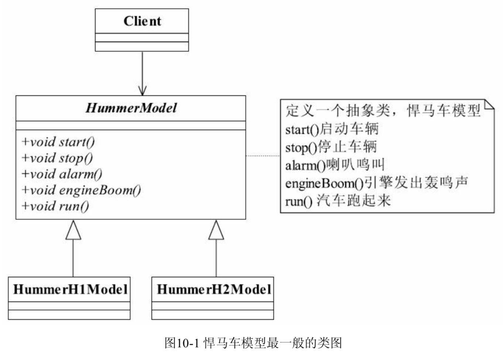
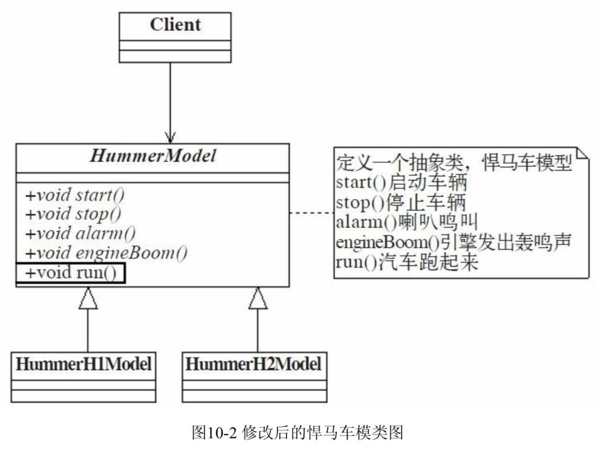
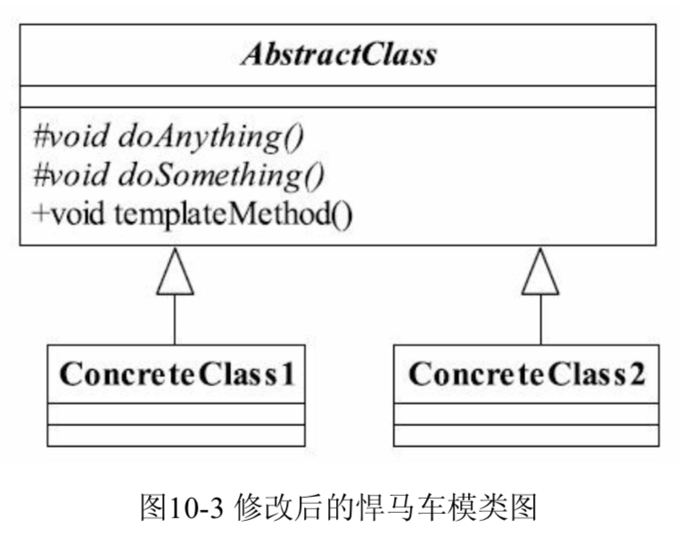
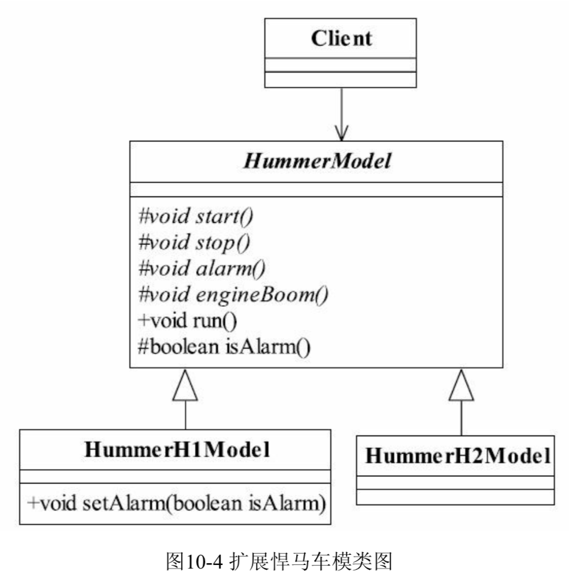

## 模板方法模式

### 制造悍马

做悍马模型，按照最一般的经验设计类图

<div align="center">
    
</div>


悍马车有两个型号，H1和H2。按照需求，只需要悍马模型，写个抽象类，然后两个不同型号的模型实现类，通过简单的继承就可以实现业务要求，先从抽象类开始编写

```java
public abstract class HummerModel {
    // 首先要能发动
    public abstract void start();
    // 还要能停下来
    public abstract void stop();
    // 喇叭会出声音
    public abstract void alarm();
    // 引擎会响
    public abstract void engineBoom();
    // 模型会跑
	public abstract void run();
}
```

在抽象类中，定义了悍马模型必须由的特质：能发动、停止，喇叭会响，引擎轰鸣，还可以停。不同型号悍马实现不同

```java
public class HummerH1Model extends HummerModel {
    // H1型号的悍马车鸣笛
    public void alarm() {
        System.out.println("悍马H1鸣笛...");
    }
    // 引擎轰鸣声
    public void engineBoom() {
        System.out.println("悍马H1引擎声音是这样的...");
    }
    // 汽车发动
    public void start() {
        System.out.println("悍马H1发动...");
    }
    // 停车
    public void stop() {
        System.out.println("悍马H1停车...");
    }
    // 开动起来
    public void run() {
        // 发动汽车
        this.run();
        // 引擎轰鸣
        this.engineBoom();
        // 按下喇叭
        this.alarm();
        // 停车
        this.stop();
    }
}
```

run()方法是一个汇总的方法。通过run()方法可以把模型所有功能测试到

```java
public class HummerH2Model extends HummerModel {
    // H2型号的悍马车鸣笛
    public void alarm() {
        System.out.println("悍马H2鸣笛...");
    }
    // 引擎轰鸣声
    public void engineBoom() {
        System.out.println("悍马H2引擎声音是这样在...");
    }
    // 汽车发动
    public void start() {
        System.out.println("悍马H2发动...");
    }
    // 停车
    public void stop() {
        System.out.println("悍马H2停车...");
    }
    // 开动起来
    public void run() {
        // 发动汽车
        this.run();
        // 引擎轰鸣
        this.engineBoom();
        // 按下喇叭
        this.alarm();
        // 停车
        this.stop();
    }
}
```

这里发现一个问题，两个实现类的run()方法都是完全相同的，那这个run()方法的实现应该出现在抽象类，不应该在实现类上，抽象是所有子类的共性封装。

**注意**：在软件开发过程中，如果**相同的一段代码复制过两次**，就需要对设计产生怀疑，架构师要明确地说明**为什么相同的逻辑要出现两次或更多次**。

修改后的类图

<div align="center">
    
</div>


注意抽象类HummerModel中的run()方法，由抽象方法变更为实现方法

```java
public abstract class HummerModel {
    // 首先要能发动
    public abstract void start();
    // 还要能停下来
    public abstract void stop();
    // 喇叭会出声音
    public abstract void alarm();
    // 引擎会响
    public abstract void engineBoom();
    // 模型会跑
    public abstract void run() {
        this.start();
        this.engineBoom();
        this.alarm();
        this.stop();
    }
}
```

在抽象的悍马模型上已经定义了run()方法的执行规则，先启动，然后引擎立刻轰鸣。中间还要按一下喇叭，制造点噪声。两个具体实现类就不需要实现run()方法了，之前的run()方法删除就好。

场景类

```java
public class Client {
    public static void main(String[] args) {
        // XX公司要H1型号的悍马
        HummerModel h1 = new HummerH1Model();
        // H1模型演示
        h1.run();
    }
}
```

这就是**模板方法模式**。

### 模板方法模式的定义

**模板方法模式**(*Template Method Pattern*)非常简单，定义如下

Define the skeleton of an algorithm in an operation, deferring some steps to subclasses. Template Method lets subclasses redefine certain steps of an algorithm without changing the algorithm's structure.

定义一个方法中的算法框架，将方法中的一些步骤**推迟到子类中实现**。这样子类可以不改变方法中的算法框架，就可以**重新定义算法中的各个执行步骤**。

<div align="center">
    
</div>


模板方法仅仅使用了Java的继承机制，但它是一个应用非常广泛的模式。AbstractClass叫做抽象模板

* 基本方法

  基本方法也叫基本操作，是由子类实现的方法，并在模板方法被调用

* 模板方法

  可以有一个或几个，一般是一个具体方法，也就是一个框架，实现对基本方法的调度，完成固定的逻辑。

  **注意**：为了防止恶意操作，一般模板方法都**加上final关键字**，不允许被覆写。

类图中还有一个角色：具体模板。ConcreteClass1和ConcreteClass2属于具体模板，实现父类所定义的一个或多个抽象方法，即父类定义的基本方法在子类中得以实现

AbstractClass

```java
public abstract class AbastractClass {
    // 基本方法
    protected abstract void doSomething();
    // 基本方法
    protected abstract void doAnything();
    // 模板方法
    public void templateMethod() {
        // 调用基本方法，完成相关逻辑
        this.doAnything();
        this.doSomething();
    }
}
```

具体模板类

```java
public class ConcreteClass1 extends AbstractClass {
    // 实现基本方法
    protected void doAnything() {
        // 业务逻辑处理
    }
    protected void doSomething() {
        // 业务逻辑处理
    }
}
public class ConcreteClass2 extends AbstractClass {
    // 实现基本方法
    protected void doAnything() {
        // 业务逻辑处理
    }
    protected void doSomething() {
        // 业务逻辑处理
    }
}
```

场景类

```java
public class Client {
    public static void main(String[] args) {
        AbstractClass class1 = new ConcreteClass1();
        AbstractClass class2 = new ConcreteClass2();
        // 调用模板方法
		class1.templateMethod();
        class2.templateMethod();
    }
}
```

注意：抽象模板中的**基本方法尽量设计为protected类型**，符合迪米特法则，**不需要暴露的属性或方法尽量不要设置为protected类型**。实现类若非必要，尽量不要扩大父类中的访问权限。

### 模板方法模式的应用

#### 模板方法模式的优点

* 封装不变部分，扩展可变部分

  把认为是**不变部分**的算法**封装到父类实现**，而**可变部分**的则可以通过**继承来继续扩展**

* 提取公共部分代码，便于维护

  如果我们不抽取到父类中，任由这种散乱的代码发生，那么维修人员为了修正一个缺陷，需要到处查找类似的代码

* 行为由父类控制，子类实现

  基本方法是由子类实现的，因此子类可以通过扩展的方式增加相应的功能，符合开闭原则

#### 模板方法模式的缺点

按照一般的设计习惯，抽象类负责声明最抽象、最一般的事物属性和方法，实现类完成具体的事物属性和方法，但是模板方法却颠倒了，抽象类定义了部分抽象方法，由子类实现，**子类执行的结果影响了父类的结果**，也就是**子类对父类产生了影响**，这在复杂项目中会**带来代码阅读的难度**，而且也会让新手产生不适感。

#### 模板方法模式的使用场景

* **多个子类公有**的方法，并且**逻辑基本相同**时
* **重要、复杂**的算法，可以把核心算法设计为模板方法，周边的相关细节则由各个子类实现
* 重构时，模板方法模式是一个经常使用的模式，把**相同的代码抽取到父类**中，然后通过**钩子函数**（见“模板方法模式的扩展”）约束其行为。

### 模板方法模式的扩展

现在的设计只要车子一旦启动，就会响喇叭，按照客户的需求，喇叭响不响应该可以设置。

新类图

<div align="center">
    
</div>


在抽象类HummerModel中增加了一个实现类isAlarm，确定各个型号的悍马是否需要声音，由各个实现类覆写该方法，同时其他基本方法由于不需要对外界提供访问，也设计为protected类型。

扩展后的抽象模板类

```java
public abstract class HummerModel {
    // 首先要能发动
    public abstract void start();
    // 还要能停下来
    public abstract void stop();
    // 喇叭会出声音
    public abstract void alarm();
    // 引擎会响
    public abstract void engineBoom();
    // 模型会跑
    public abstract void run() {
        this.start();
        this.engineBoom();
        if (this.isAlarm()) {
            this.alarm();
        }
        this.stop();
    }
    // 钩子方法，默认喇叭会响
    protected boolean isAlarm() {
        return true;
    }
}
```

在抽象类中，isAlarm是一个实现方法，作用是模板方法根据其返回值决定是否要响喇叭，子类可以覆写该返回值，H1型号的喇叭响不响要自定义设置。

扩展后的H1悍马

```java
public class HummerH1Model extends HummerModel {
	private boolean alarmFlag = true;	// 要响喇叭
    protected void alarm() {
        System.out.println("悍马H1鸣笛...");
    }
    protected void engineBoom() {
        System.out.println("悍马H1引擎声音是这样的...");
    }
    protected void start() {
        System.out.println("悍马H1发动...");
    }
    protected void stop() {
        System.out.println("悍马H1停车...");
    }
    protected boolean isAlarm() {
        return this.alarmFlag;
    }
    // 用户自定义决定要不要响喇叭
    public void setAlarm(boolean isAlarm) {
        this.alarmFlag = isAlarm;
    }
}
```

H2型号没喇叭响

```java
public class HummerH1Model extends HummerModel {
    protected void alarm() {
        System.out.println("悍马H1鸣笛...");
    }
    protected void engineBoom() {
        System.out.println("悍马H1引擎声音是这样的...");
    }
    protected void start() {
        System.out.println("悍马H1发动...");
    }
    protected void stop() {
        System.out.println("悍马H1停车...");
    }
    // 用户自定义决定要不要响喇叭
    protected boolean isAlarm() {
        this.alarmFlag = isAlarm;
    }
}
```

扩展后的场景类

```java
public class Client {
    public static void main(String[] args) throws IOException {
        System.out.println("------H1型号悍马------");
        System.out.println("H1型号的悍马是否需要喇叭声响？0-不需要 1-需要");
        String type = (new BufferReader(new InputStreamReader(System.in))).readLine().toString();
        HummerH1Model h1 = new HummerModel();
        if(type.equals("0")) {
            h1.setAlarm(false);
        }
        h1.run();
        System.out.println("\n------H2型悍马------");
        HummerH2Model h2 = new HummerModel();
        h2.run();
    }
}
```

运行的时候要交互，先输入H1型号悍马是不是有声音。

H1型号的悍马是由用户自己控制是不是要响喇叭，也就是说外界条件改变，能够影响到模板方法的执行。

在抽象类中isAlarm的返回值就是影响了模板方法的执行结果，该方法就叫做**钩子方法**(*Hook Method*)。

模板方法就是在模板方法中**按照一定的规则和顺序**调用基本方法。

### 最佳实践

初级程序员在写程序时常常会问“**父类怎么调用子类的方法**”。父类可以用以下方式调用子类的方法

* 把子类**传递到父类的有参构造**中，然后调用
* 使用**反射**的方式调用
* 父类调用子类的**静态**方法

这三种就是父类直接调用子类的方法。这样可以解决问题，但项目中不建议、不允许这么做。**如果一定要用父类调用子类方法，那就没有必要让子类继承父类，直接调用子类即可**。

换个角度理解，父类建立框架，子类在重写了父类的部分方法后，再调用从父类继承的方法，产生不同的结果（模板方法模式）。即修改了子类，影响了父类行为的结果。

模板方法在一些开源框架中有非常多应用，提供一个抽象类，然后开源框架写一堆子类。

如果要扩展功能，**就继承抽象类**，然后**覆写protected方法**，再调用一个**类似的execute方法**，完成扩展开发。